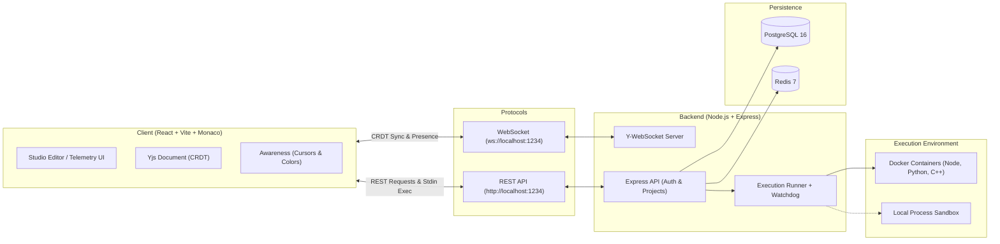

# ⚡ CodeCollab Studio: Real-Time Collaborative Code Studio

> **High-Performance CRDT-Synchronized Collaborative IDE & Sandboxed Execution Studio**  
> *7th-Semester B.Tech Computer Science & Engineering Major Project by [Ojaswi Shivam](https://github.com/ojaswishivam)*

---

## 🌟 Overview

**CodeCollab Studio** is an enterprise-grade, distributed collaborative code editor and multi-language runtime sandbox designed for low-latency pair programming, remote engineering teams, and collaborative coding interviews.

Powered by **Conflict-Free Replicated Data Types (Yjs CRDT)** and **WebSocket synchronization**, CodeCollab guarantees mathematical state convergence across arbitrary concurrent peers without merge conflicts, cursor locking, or data loss.


---

## ✨ Key Features

### 🚀 1. Conflict-Free Real-Time Collaborative Editing (CRDT)
* **Monaco Editor Integration:** Embedded VS Code core editor with syntax highlighting, line numbers, multi-cursor support, and direct `Ctrl+Enter` internal keybindings.
* **Yjs Mathematical Convergence:** Lamport-timestamped operations guarantee zero-conflict data convergence across concurrent editors typing at the exact same moment.
* **Ground-Truth Execution:** Code execution payloads are synchronized perfectly by reading directly from `editorInstance.getValue()` rather than standard DOM state.
* **Presence & Dynamic Cursors:** Real-time visual tracking of collaborator names, custom cursor colors, active selections, and ping latencies.
* **Zero-Lag UI Controls:** Instant React DOM language selector popover (Node.js, Python 3, C++) and font size stepper (`11px`–`24px`) with 0ms click latency.

### 🔒 2. Multi-Language Sandboxed Execution with Stdin Support
* **Supported Languages:**
  * 🟡 **JavaScript** (Node.js 20 LTS)
  * 🐍 **Python 3** (Python 3.11)
  * ⚡ **C++** (GCC 13 with `-O2` compiler optimization)
* **Interactive Standard Input (`stdin`):** Dedicated `Custom Input (stdin)` terminal tab allows interactive programs (`input()`, `cin >>`, `sys.stdin.read()`) to receive custom stdin payloads.
* **5-Second Watchdog Timer:** Hard supervisory timeout terminating infinite loops and fork bombs via `SIGKILL`.
* **Container Isolation & Capping:** Dual-mode execution (Docker container or isolated process) enforcing:
  * `--network none` (Zero outbound network access)
  * `--memory 128m` (Strict RAM memory cap)
  * `--cpus 0.5` (CPU quota limitation)
  * `--pids-limit 64` (Process fork bomb prevention)
  * Non-root unprivileged execution user (`sandboxuser`)
* **Shared Terminal Console:** Output (`stdout`, `stderr`, runtime duration, exit codes, execution mode) is synchronized across all peers in the room in real time.
* **Intelligent Toast Notifications:** Smart "Runtime Mismatch" detection surfaces as a non-intrusive global floating toast notification rather than cluttering terminal output.
* **Terminal Controls:** Collapsible/resizable height presets (`S`, `M`, `L`), fullscreen toggle, copy output with feedback, and log export.

### 📊 3. Real-Time Telemetry & System Analytics Dashboard
* **Execution Latency Timeline:** Responsive bar chart plotting recent runtime durations (ms) with status indicators.
* **Language Distribution:** Usage share breakdown across active programming languages.
* **Searchable & Filterable Live Audit Stream:** Real-time table with keyword search and status filters (Success, Runtime Error, Compile Error, Timed Out).
* **JSON Metrics Export:** Single-click export of complete system telemetry for benchmarks and auditing.

### 🛡️ 4. Enterprise Persistence & Authentication
* **PostgreSQL 16 & Redis 7:** Relational schema supporting user registration, salted bcrypt password hashing, and serialized Yjs binary state (`BYTEA`) storage.
* **JWT Stateless Authentication:** Secure 7-day token issuance and authenticated project management APIs (`GET`, `POST`, `DELETE /api/projects/:id`).
* **1-Click Quick Demo Access:** Built-in demo credentials button (`demo@codecollab.io` / `password123`) for instant evaluation.
* **Zero-Config In-Memory Fallback:** Built-in seamless fallback store for instant local evaluation without requiring a running database.

---

## 🏗️ System Architecture



---

## 📂 Project Structure

```
collab-code-editor/
├── client/                     # Frontend Application (React 18 + Vite + Tailwind CSS)
│   ├── src/
│   │   ├── components/
│   │   │   ├── AuthModal.tsx         # User Login / Signup modal with demo fill
│   │   │   ├── CollabEditor.tsx      # Core Monaco + Yjs editor canvas & status bar
│   │   │   ├── ExecutionPanel.tsx    # Synced output terminal, stdin tab & controls
│   │   │   ├── MetricsDashboard.tsx  # Telemetry analytics, charts & audit stream
│   │   │   ├── PresenceBar.tsx       # Live collaborator chips, rename & invite
│   │   │   └── ProjectsModal.tsx     # Workspace management, search & deletion
│   │   ├── App.tsx                   # Main layout, room switcher & toast notifications
│   │   ├── config.ts                 # Dynamic API & WebSocket endpoint resolution
│   │   ├── index.css                 # Dark-mode styling tokens & glassmorphism
│   │   └── main.tsx                  # React entry point
│   ├── Dockerfile                    # Client production container
│   ├── package.json
│   └── vite.config.ts
│
├── server/                     # Backend Server (Node.js + Express + WebSocket)
│   ├── src/
│   │   ├── db/
│   │   │   ├── index.ts              # PostgreSQL connection & memory fallback
│   │   │   └── schema.sql            # Database DDL schema (users, projects)
│   │   ├── execution/
│   │   │   └── runner.ts             # Sandbox dispatcher, stdin pipe & 5s watchdog
│   │   ├── metrics/
│   │   │   └── store.ts              # Telemetry store & aggregation engine
│   │   ├── routes/
│   │   │   ├── auth.ts               # JWT signup, login, /me routes
│   │   │   └── projects.ts           # Project CRUD & delete endpoints
│   │   └── server.ts                 # Express & WebSocket entry point
│   ├── Dockerfile                    # Server container
│   └── package.json
│
├── docker/                     # Isolated Sandbox Container Definitions
│   ├── sandbox-cpp/Dockerfile        # GCC 13 C++ runner
│   ├── sandbox-node/Dockerfile       # Node.js 20 runner
│   └── sandbox-python/Dockerfile     # Python 3.11 runner
│
├── docker-compose.yml          # Multi-container stack orchestration
├── PROJECT_REPORT.md           # 7th-Sem B.Tech CSE Comprehensive Project Report
├── .gitignore                  # Git ignore rules
└── README.md                   # Repository documentation
```

---

## ⚡ Getting Started

### Prerequisites
* [Node.js](https://nodejs.org/) (v18 or higher)
* [npm](https://npmjs.com/) (v9 or higher)
* [Docker Desktop](https://www.docker.com/) (Optional, for container sandbox & compose orchestration)

---

### Option 1: Local Development (Quick Start)

#### 1. Clone the repository
```bash
git clone https://github.com/ojaswishivam/CodeCollab.git
cd CodeCollab
```

#### 2. Start the Backend Server
```bash
cd server
npm install
npm run dev
```
*Server will start on `http://localhost:1234` (WebSocket active on `ws://localhost:1234`).*

#### 3. Start the Frontend Client
```bash
cd ../client
npm install
npm run dev
```
*Client will launch on `http://localhost:5173`.*

---

### Option 2: Full Docker Compose Deployment

```bash
# 1. Build sandbox runner images
cd docker/sandbox-node && docker build -t sandbox-node .
cd ../sandbox-python && docker build -t sandbox-python .
cd ../sandbox-cpp && docker build -t sandbox-cpp .
cd ../..

# 2. Start all services
docker-compose up --build -d
```
* Access Web App: `http://localhost:5173`
* Backend API & WebSocket: `http://localhost:1234`
* PostgreSQL: `localhost:5432`
* Redis: `localhost:6379`

---

## 📡 API Reference

| Method | Endpoint | Auth | Description | Request Body |
| :--- | :--- | :--- | :--- | :--- |
| `POST` | `/api/auth/signup` | Public | Register new user account | `{ email, password, displayName }` |
| `POST` | `/api/auth/login` | Public | Authenticate user & return JWT token | `{ email, password }` |
| `GET` | `/api/auth/me` | Bearer JWT | Retrieve current user profile | None |
| `GET` | `/api/projects` | Bearer JWT | Fetch saved user workspaces | None |
| `POST` | `/api/projects` | Bearer JWT | Create new persistent workspace | `{ name, roomId, language }` |
| `DELETE`| `/api/projects/:id` | Bearer JWT | Delete workspace by ID | None |
| `POST` | `/api/execute` | Public | Execute code with optional stdin | `{ language, code, stdin? }` |
| `GET` | `/api/metrics` | Public | Retrieve telemetry stats & audit logs | None |
| `GET` | `/health` | Public | Server healthcheck probe | None |

---

## 🧪 Pre-Seeded Demo Credentials

For instant evaluation without registration:
* **Email:** `demo@codecollab.io`
* **Password:** `password123`
*(Or click **"Fill Quick Demo Credentials"** directly inside the Sign In modal)*

---

## 📜 Academic Project Information

* **Degree:** Bachelor of Technology (B.Tech) in Computer Science & Engineering
* **Author:** [Ojaswi Shivam](https://github.com/ojaswishivam)
* **Semester:** 7th Semester – Major Project
* **Full Documentation:** See [`PROJECT_REPORT.md`](file:///e:/Projects/collab-code-editor/PROJECT_REPORT.md) for the complete academic report, benchmark analysis, and mathematical proofs.

---

## 📄 License

This project is licensed under the MIT License - see the LICENSE file for details.
